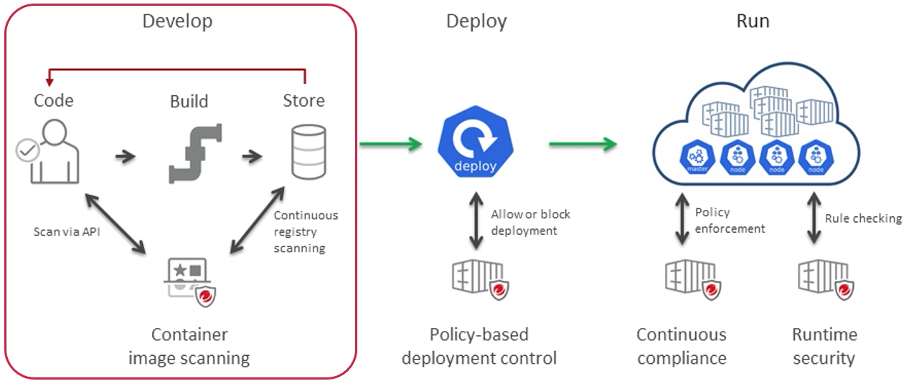
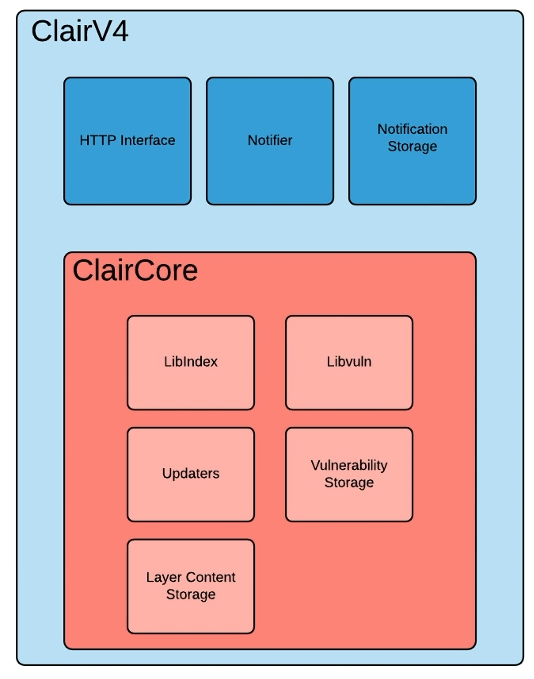
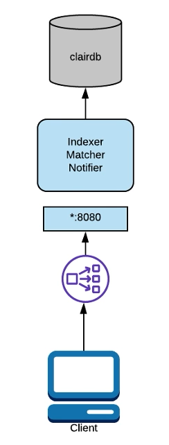
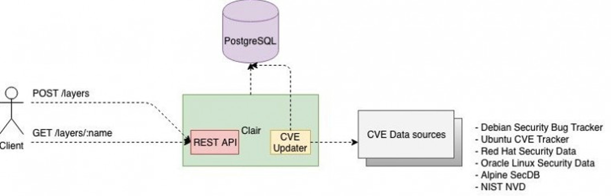
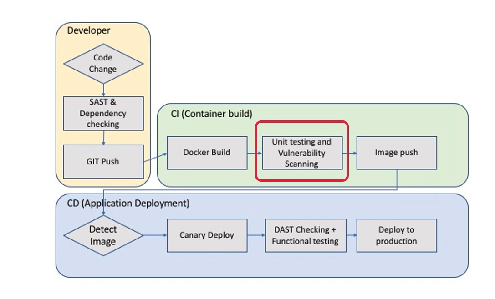

# 컨테이너 보안을 위한 Clair 활용

[클레어 공식문서](https://quay.github.io/clair/concepts/indexing.html)

## 1. Docker 컨테이너 보안

<p align ="center">
    
</p>

- 보안 단계는 개발 단계에서 이루어진다.
- `정적 코드 분석` : Jacoco와 Sonarqube가 정적 코드 분석에 해당한다. (코드 작성 때 보안 요소 확인)
- `종속성 확인` : 라이브러리와 종속성의 보안 영향이 있는지 확인하는 것이 중요하고, 프로젝트 별 종속성을 식별하고 알려진 보안 취약점이 있는지 확인하는 것이 중요하다.
- `컨테이너 이미지 스캔` : 컨테이너 이미지 빌드 시 보안 취약점을 스캐닝 한다. (clair)

## 2. clair

- 컨테이너의 취약점에 대한 정적분석을 위한 오픈 소스 프로젝트
- 클라이언트는 clair api를 사용해서 컨테이너 이미지를 색인화한 다음 알려진 취약점과 대조할 수 있다.
- 컨테이너 기반 인프라의 보안을 보다 투명하게 볼 수 있도록 하는 것이 목표이다.

> 색인화를 하면 이미지의 기능 목록이 만들어지고, 데이터베이스에 저장된다. 클라이언트는 clair와 api를 사용하여, 데이터베이스의 특정 이미지의 취약점을 쿼리한다. 각 요청에 대해 취약점과 기능의 상관관계를 파악하여 이미지를 다시 스캔할 필요가 없다.
> 취약점 메타데이터에 대한 업데이트가 발생하면, 시스템의 변경사항이 발생했음을 알리는 알람을 보낼 수 있다.

---

<p align ="center">
    
</p>

- `ClairCore` : 컨텐츠 검사, 취약점 보고를 하기 위한 엔진

  - 높은 수준의 claircore 라이브러리에서 제공하는 기능에 대한 clair 서비스 wrapper를 제공할 수 있다.
  - 취약성 소스와 레이어 인덱스와 관련된 대부분의 개발은 claircore를 통해 적용이 된다.
  - `Updaters :` rest api 서버를 통해 취약점 데이터베이스의 업데이트를 담당한다.

---

**clair core로 할 수 있는 것 :**

- Updaters와 데이터 소스 목록을 처리하는 부분을 구현할 수 있다.
- 취약점 데이터베이스 저장 및 업데이트 된 도커 이미지 레이어 분석 결과를 출력하는 결과를 구현할 수 있다.

---

<p align ="center">
    
</p>

> 매니페스트는 컨테이너 이미지에 대한 클레어 명세 내용이다. 클레어는 OCI 매니페스트 및 레이어가 중복 작업을 줄이기 위해 컨텐츠 주소를 지정한다는 기능을 활용한다. 매니페스트가 인덱싱되면 나중에 검색할 수 있도록 인덱스 레포트가 유지된다.

- 인덱싱 부분 : 매니페스트를 클레어에 전달하는 것으로 시작된다.

  - 인덱싱을 수신 받으면 클레어는 컨테이너 이미지의 레이어 정보를 가져오고
    해당 컨텐츠를 스캔한 다음 인덱스 레포트라는 중간 데이터를 반환한다.

- 매칭 부분 : 인덱스 레포트를 가져오고, 레포트가 나타내는 매니페스트에 영향을 미치는 관련 취약점을 연결한다.

  > 클레어는 지속적으로 새로운 보안 데이터를 수집하고 있으며, 매칭서버에 대한 요청을 통해 항상 인덱스 레포트의 최신 취약점을 분석하고 제공한다.

- 알림 부분 : 클레어는 노티피케이션을 통해 알람 서비스를 구현한다. 새로운 취약점이 발견되면 알람 서비스는 이러한 취약점이 인덱싱된 매니페스트에 영향을 미치는지 확인한다. 관리자는 알람을 통해 구성에 따라 조치를 취할 수 있다.

---

## 3. 컨테이너 이미지 분석 방식

<p align ="center">
    
</p>

- 특정 이미지 레포지토리의 컨테이너 이미지가 있어야 접근해서 분석 수행 가능

  - 특정 레포지토리의 이미지를 선택해서 로컬에서 혹은, 클레어 서버를 통해 해당 이미지를 가져온다.

- 레지스트리에 있는 컨테이너 이미지를 사용해서 해당 레이어의 http url을 통해 레이어의 tar를 가져와 분석한다.

- 앞서 분석한 이미지 레이어 외에 다른 레이어를 분석하기 위해 다른 api 엔드포인트를 통해서 tar 파일을 얻는다. 이러한 api 호출방식에 따라 클레어가 컨테이너 이미지를 각각의 이미지 레이어별로 수행할 수 있다.

- 클레어에게 하나로 통합된 스캔 가능한 레이어로 구성된 도커이미지를 통합적으로 분석할 수 있도록 진행할 수 있다. 이를 위해 몇가지 매개변수를 사전에 작성하여 api를 통해 http 호스트 방식으로 호출해 클레어가 분석한 결과값들을 취합하여 json 형식으로 리턴을 받아올 수 있다.

> clairctl를 통해 간편하게 스캔 가능

## 4. clair와 jenkins 연동

<p align ="center">
    
</p>

## 5. 설치

```sh
# clair DB, clair 서버 컨테이너 실행
docker run -p 5432:5432 -d --name db arminc/clair-db:latest
docker run -p 6060:6060 --link db:postgres -d --name clair arminc/clair-local-scan:latest


# clair-scanner  설치 (clair 보안 취약점 스캔 기능을 사용하기 위해 clairctl이라는 cli 바이너리 툴 사용)
wget https://github.com/arminc/clair-scanner/releases/download/v12/clair-scanner_linux_amd64

chmod +x clair-scanner_linux_amd64; sudo mv clair-scanner_linux_amd64 /usr/local/bin/clair-scanner
```

## 6. Clair 보안 설정 및 Docker 빌드 스캔 수행
